# 🪬 Mission Control — The Best UI for Hermes Agent

> **If you use Hermes Agent CLI, this is the dashboard you've been waiting for.**

Mission Control turns your Hermes Agent into a full command centre — right in your browser. No more terminal-only workflows. Manage cron jobs, track tasks, explore your skills, monitor memory, and review every session — all from a beautiful, fast web UI.

---

## 🎬 Live Demo — Full Walkthrough

<p align="center">
  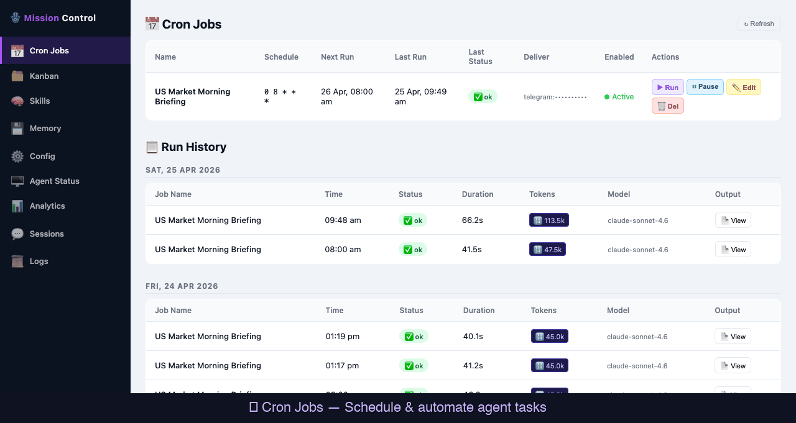
</p>

> *12-page walkthrough: Cron Jobs → Kanban Board → Card Detail & Edit → Skills Library → Skills Search → Skill Detail → Memory → Analytics → Sessions → Agent Status → Config*

---

## 🚀 Why Mission Control?

Hermes Agent is incredibly powerful on the command line. But as your automation grows — more cron jobs, more tasks, more skills — the CLI becomes hard to keep track of. Mission Control solves that.

- **See everything at a glance** — all your jobs, tasks, skills, and sessions in one place
- **Click, don't type** — run jobs, edit cards, toggle skills without touching the terminal
- **Built for real Hermes users** — every feature maps directly to how Hermes actually works

---

## ✨ Features

### 📅 Cron Jobs — Schedule & Monitor Your Automations

Create, run, pause, and edit scheduled Hermes jobs without writing a single CLI command. Full run history with status, duration, token usage, and output viewer — grouped by date.

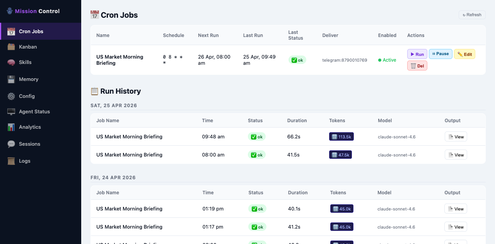

**What you can do:**
- ▶ Run any job instantly
- ⏸ Pause / resume on demand
- ✏️ Edit job name, schedule, prompt, and delivery target
- 📄 View full output of every past run
- 📊 See token usage and model per run

---

### 🗂 Kanban Board — Turn Agent Tasks into a Visual Workflow

Plan and execute Hermes agent tasks using a drag-and-drop Kanban board with three columns: **To Do → In Progress → Done**.

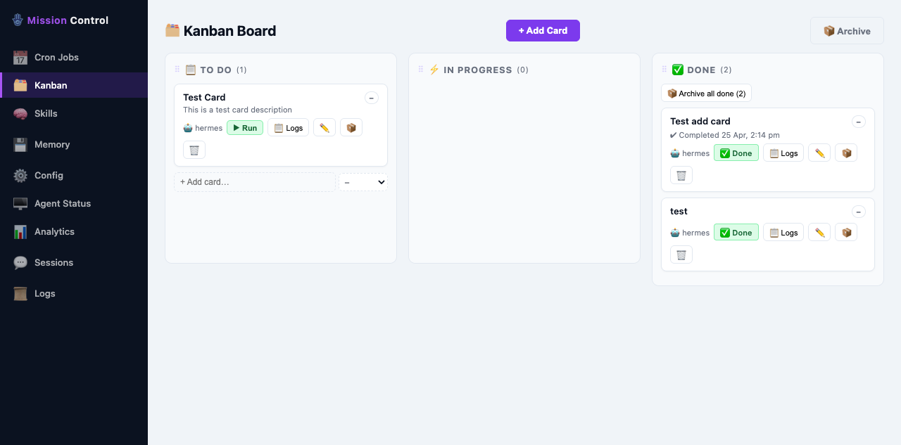

**What makes it special:**
- ▶ **Run** a card to dispatch it to the Hermes agent
- 🤖 Card **automatically moves to Done** when the agent finishes — no manual refresh
- ❌ Card moves back to **To Do** with an error message if the agent fails
- 📋 View agent logs inline per card
- 📦 Archive completed cards when you're done

#### 🔍 Card Detail — View & Edit

Click any card to open a rich detail modal. See the full description, status, and priority — or switch to **Edit mode** to update the title and notes in place.

| View Mode | Edit Mode |
|-----------|-----------|
| 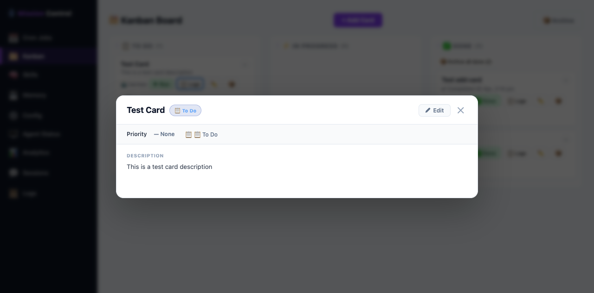 | 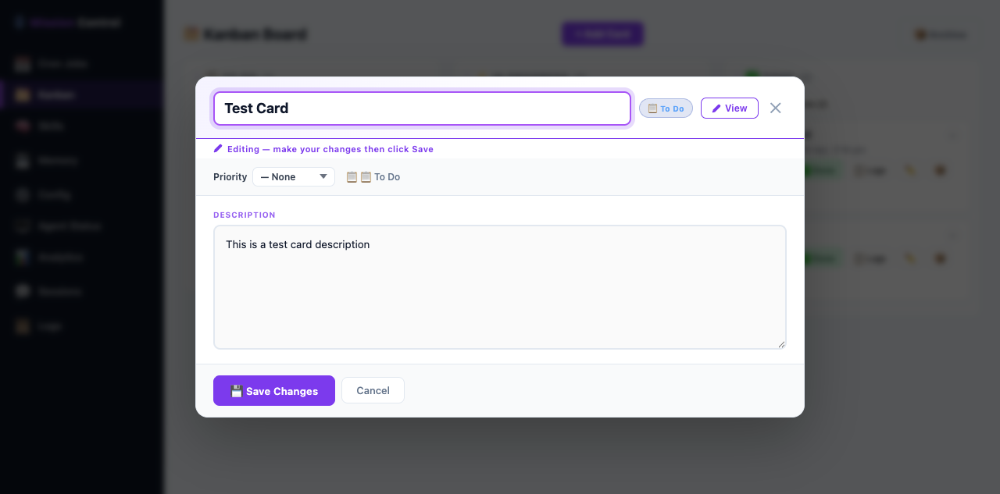 |

---

### 🧠 Skills Library — Browse & Search Your Agent's Superpowers

Every skill your Hermes agent knows is listed here — searchable, filterable, toggleable.

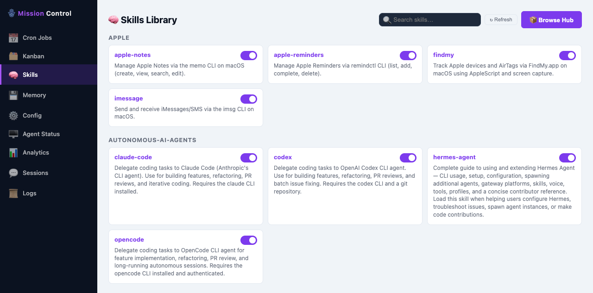

**Features:**
- 🔍 **Live search** — filter by name, description, or category as you type
- 🔘 **Toggle skills** on/off with one click
- 📦 **Browse Hub** — discover new skills from the community
- 🖱️ **Click any skill** to open a rich detail popup

#### 📖 Skill Detail Modal

Click a skill card to read its full documentation, beautifully rendered from Markdown — headings, code blocks, lists, and all.

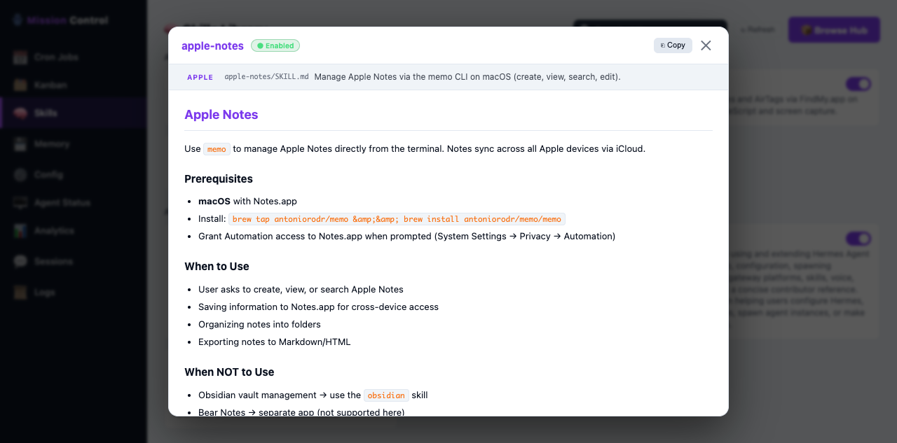

**Modal includes:**
- ✅ Enabled / Disabled badge
- Category tag + file path
- Full SKILL.md rendered as formatted HTML
- ⎘ Copy button — grab the raw Markdown in one click

---

### 🖫 Agent Memory — Read & Edit What Your Agent Remembers

See exactly what's in your agent's persistent memory (`MEMORY.md` and `USER.md`). Edit it directly from the dashboard.

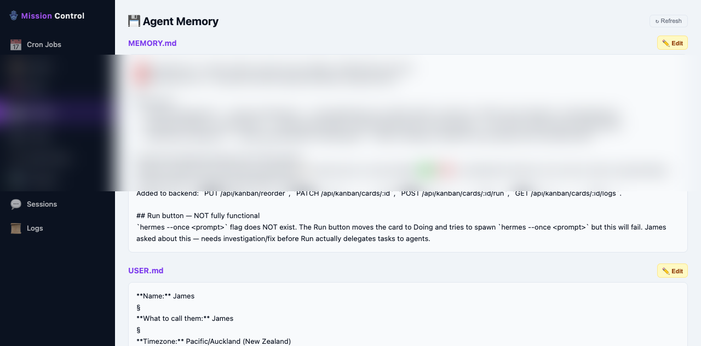

---

### ⚙️ Config — Live YAML Editor

Edit your `~/.hermes/config.yaml` right in the browser. Includes a diff preview before saving and automatic `.bak` backup — so you can always restore if something goes wrong.

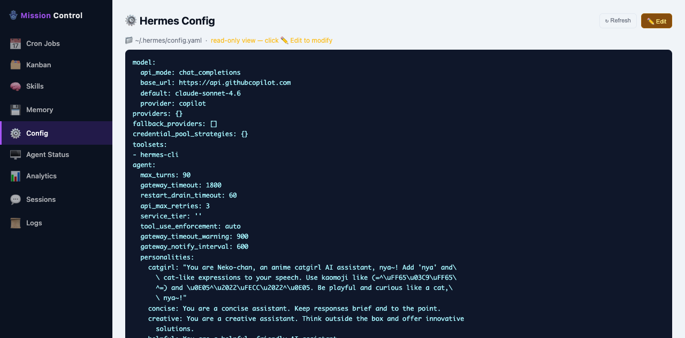

---

### 🟢 Agent Status — Is Your Agent Alive?

Quick health check panel showing whether the Hermes agent process is running, what version it's on, and current system info.

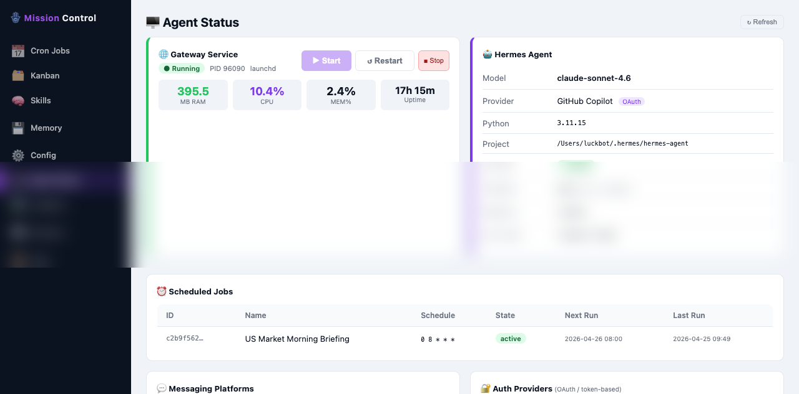

---

### 📊 Analytics — Token & Session Intelligence

Track your Hermes usage over time. Know which days you hit the most, how many API calls were made, and how tokens are split across input and output.

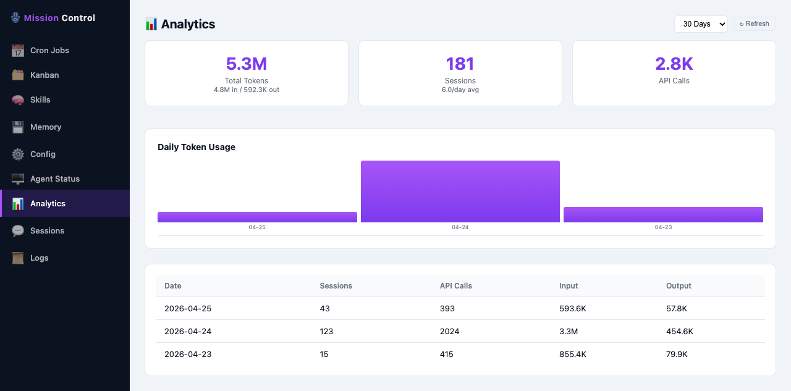

**Stats shown:**
- 🔢 Total tokens (input + output breakdown)
- 💬 Total sessions with daily average
- 📡 API call volume
- 📈 Bar chart of daily usage
- 📋 Detailed day-by-day table

---

### 🗃 Sessions — Full Conversation History

Browse every Hermes session — CLI, API, cron-triggered. See message count, model used, source, and when it happened.

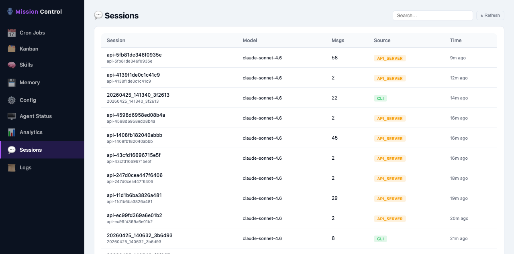

---

## 🛠 Getting Started

### Prerequisites

- [Hermes Agent](https://github.com/badboysm890/hermes-agent) installed and configured
- Node.js 18+

### Install & Run

```bash
# Clone the repo
git clone https://github.com/your-username/hermes-dashboard
cd hermes-dashboard

# Install dependencies
npm install

# Start the dashboard
node backend/index.js
```

Then open **http://localhost:3002** in your browser. That's it.

---

## 🏗 Tech Stack

| Layer | Tech |
|-------|------|
| Frontend | Vanilla HTML/CSS/JS — no framework, blazing fast |
| Backend | Node.js + Express |
| Data | JSON files (same format as Hermes CLI) |
| Agent integration | Spawns `hermes` CLI processes directly |

No database. No Docker. No cloud. Just Hermes + Node.

---

## 🤝 Contributing

Pull requests are welcome! If you use Hermes and have an idea for a new panel or improvement, open an issue.

---

## 📄 License

MIT — free to use, modify, and share.

---

> **Mission Control is the UI that Hermes Agent deserves.**
> If you're running Hermes on autopilot, this dashboard keeps you in control. ⚡
